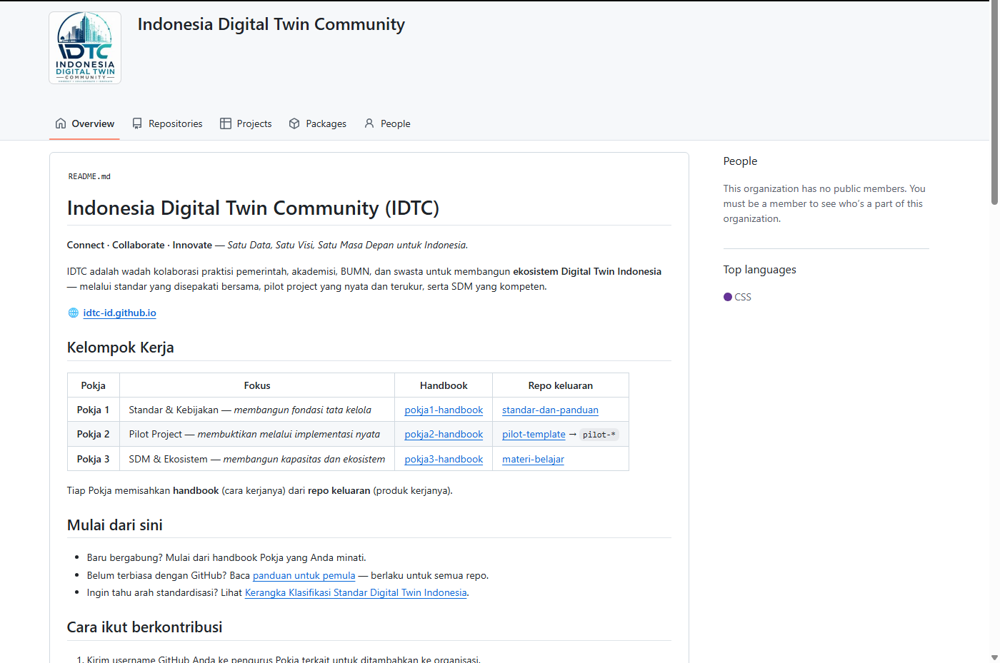
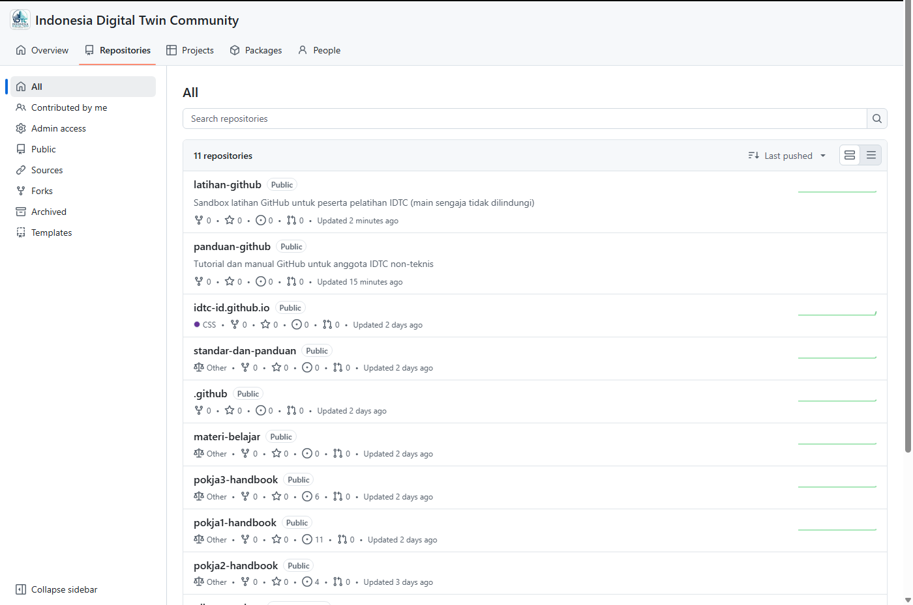

# M1 — Mengapa IDTC Memakai GitHub

**Tingkat:** T0 — Pengamat &nbsp;·&nbsp; **Durasi:** 15 menit &nbsp;·&nbsp; **Prasyarat:** Tidak ada

## Tujuan

Setelah modul ini, Anda dapat:

- Menyebutkan tiga alasan IDTC memakai GitHub sebagai ruang kerja bersama.
- Menyebutkan tiga hal yang dapat Anda lakukan di GitHub tanpa kemampuan pemrograman.
- Menemukan handbook Pokja Anda sendiri di `idtc-id`.

## Kenapa tidak hanya di WhatsApp Group Saja?

Selama ini koordinasi IDTC sangat aktif lewat grup WhatsApp. tetapi ada beberapa tantangan jika hanya menggunakan WhatsApp:

1. **Versi dokumen tercecer.** Draf kebijakan bisa beredar sebagai lima lampiran berbeda di lima percakapan, dan tidak ada yang tahu mana yang paling baru.
2. **Keputusan hilang ditelan riwayat chat.** Kesepakatan rapat sering hanya tersimpan sebagai pesan yang lewat begitu saja, sulit dicari tiga bulan kemudian.
3. **Tidak ada jejak siapa mengubah apa.** Ketika sebuah angka di dokumen berubah, tidak ada catatan otomatis tentang siapa yang mengubahnya dan kenapa.

GitHub dipilih  karena GitHub pada dasarnya adalah **lemari arsip bersama yang mencatat setiap perubahan**: siapa mengubah, apa yang diubah, dan kapan. Setiap dokumen, keputusan, dan usulan tersimpan di satu tempat yang bisa ditelusuri kembali.

## Apa isi organisasi idtc-id

Organisasi `idtc-id` di GitHub berisi beberapa repositori (disingkat **repo** — anggap sebagai satu folder proyek lengkap dengan riwayat perubahannya):

- **Tiga handbook Pokja** — `pokja1-handbook`, `pokja2-handbook`, `pokja3-handbook` — tempat setiap kelompok kerja mencatat rencana, keputusan, dan progresnya.
- **Repo keluaran**, seperti `standar-dan-panduan` (dokumen standar Digital Twin) dan `materi-belajar` (kurikulum dan modul pelatihan Pokja 3).
- **Situs komunitas**, `idtc-id.github.io` — halaman publik yang Anda lihat di browser.
- **Board pemantauan capaian**, tempat target dan tugas komunitas dilacak.

Penting untuk digarisbawahi: **sebagian besar isi repo IDTC adalah dokumen berformat teks (Markdown), bukan kode program.** Membaca dan mengubahnya sama seperti mengetik di aplikasi pengolah kata, hanya saja dilakukan di browser.

## Apa yang bisa dilakukan tanpa menulis kode

Tanpa kemampuan pemrograman sama sekali, seorang anggota IDTC sudah bisa:

- Membaca dokumen dan menelusuri riwayat perubahannya.
- Bertanya atau berdiskusi lewat fitur **Discussions**.
- Mencatat usulan atau tugas lewat fitur **Issues**.
- Memperbaiki kalimat atau menambah data pada dokumen langsung lewat browser.

Semua itu akan dipelajari pada modul-modul berikutnya. Modul ini baru mengenalkan tempatnya.

## Langkah (praktik)

1. Buka browser dan kunjungi `github.com/idtc-id`.

   

2. Perhatikan daftar repo yang tampil. Cari repo dengan nama Pokja Anda sendiri, misalnya `pokja2-handbook` bila Anda anggota Pokja 2.

   

3. Klik nama repo tersebut untuk membukanya. Anda akan melihat daftar folder dan berkas — ini disebut tampilan **Code**.
4. Klik berkas `README.md`. Berkas ini akan otomatis tampil rapi dan terformat, bukan sebagai teks mentah.

   

5. Gulir sebentar untuk melihat isinya, lalu selesai — Anda sudah berhasil menemukan "rumah" Pokja Anda di GitHub.

## Latihan

Buka `github.com/idtc-id`, temukan handbook Pokja Anda sendiri, lalu buka satu dokumen apa pun di dalamnya sampai Anda bisa membacanya dengan nyaman di layar.

## Kesalahan umum yang harus diantisipasi

- **Peserta mengira harus memasang aplikasi terlebih dahulu.** Tegaskan sejak awal: seluruh modul ini bisa dikerjakan hanya lewat browser, tanpa memasang apa pun di komputer.
- **Peserta bingung membedakan "organisasi" dan "repo".** Jelaskan dengan analogi: organisasi `idtc-id` adalah gedung komunitas, dan setiap repo adalah satu ruangan di dalamnya dengan fungsi berbeda.

## Ringkasan

IDTC memakai GitHub karena mencatat riwayat perubahan secara otomatis — sesuatu yang tidak bisa diberikan WhatsApp atau surel. Sebagian besar pekerjaan di sana berupa dokumen, bukan kode, dan bisa dikerjakan penuh lewat browser. Organisasi `idtc-id` menampung handbook tiap Pokja, repo keluaran, situs komunitas, dan papan pemantauan capaian. Modul berikutnya (M2) akan memandu Anda membuat akun dan bergabung ke organisasi ini.
