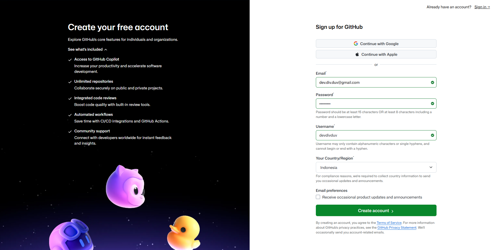
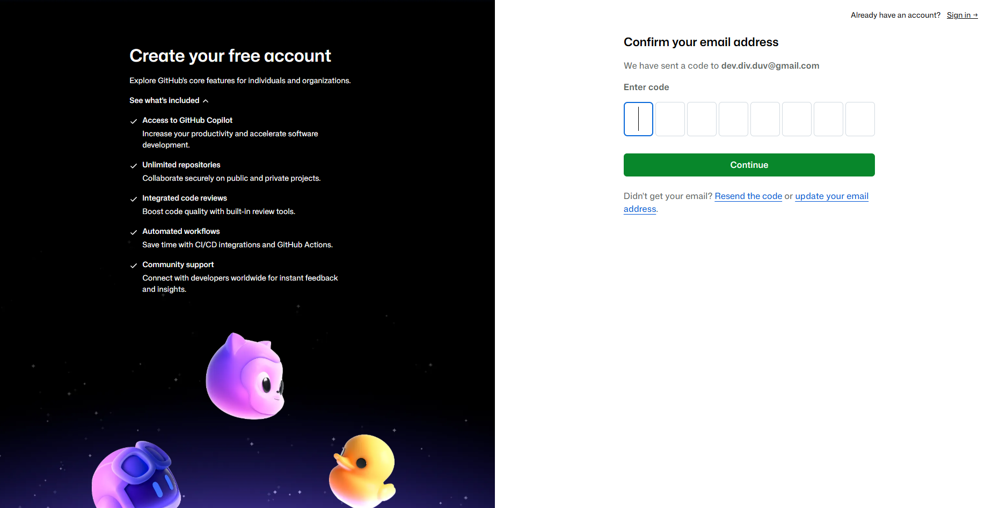
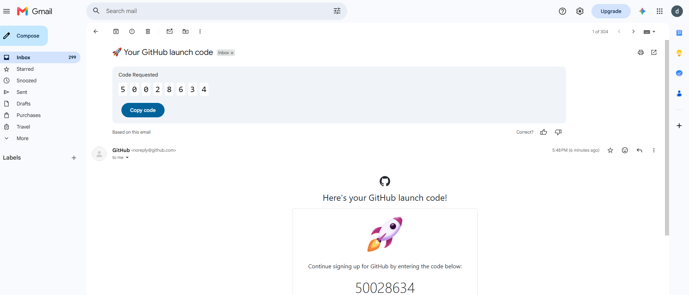
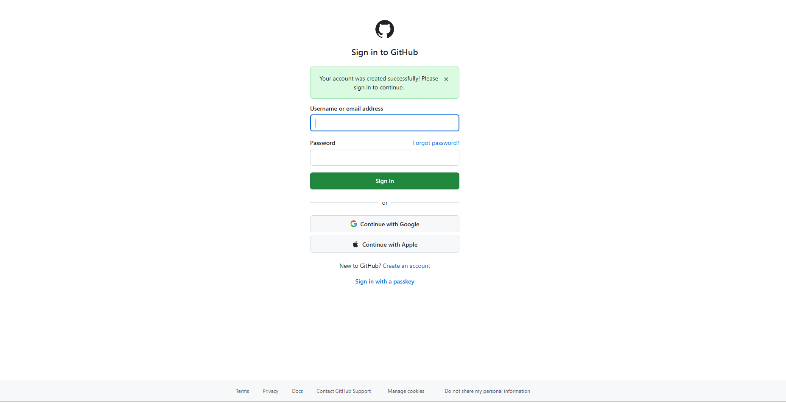
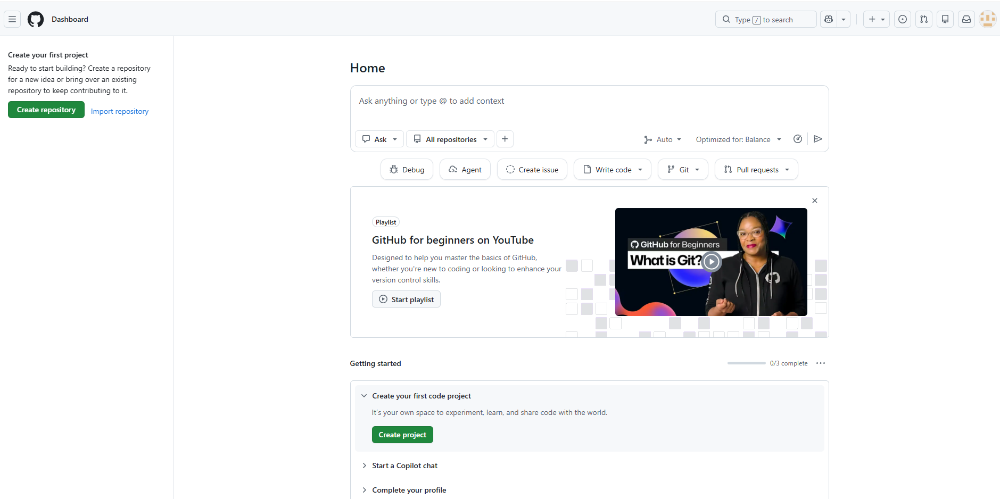
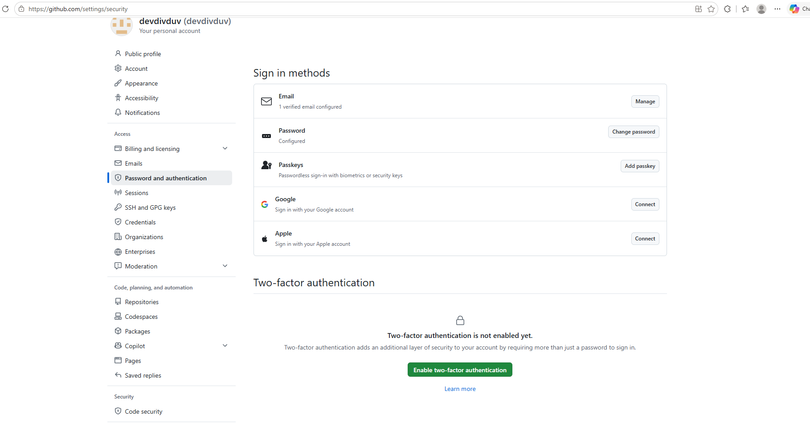
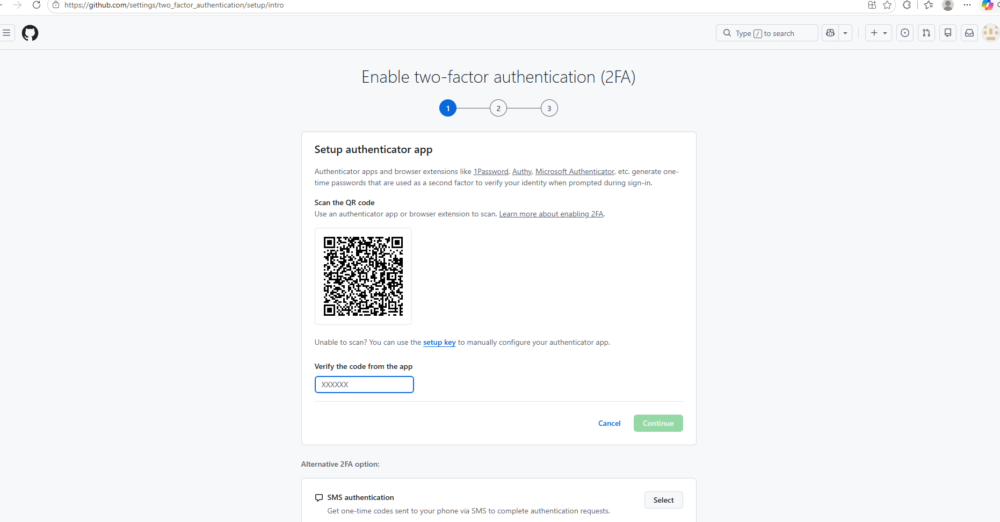
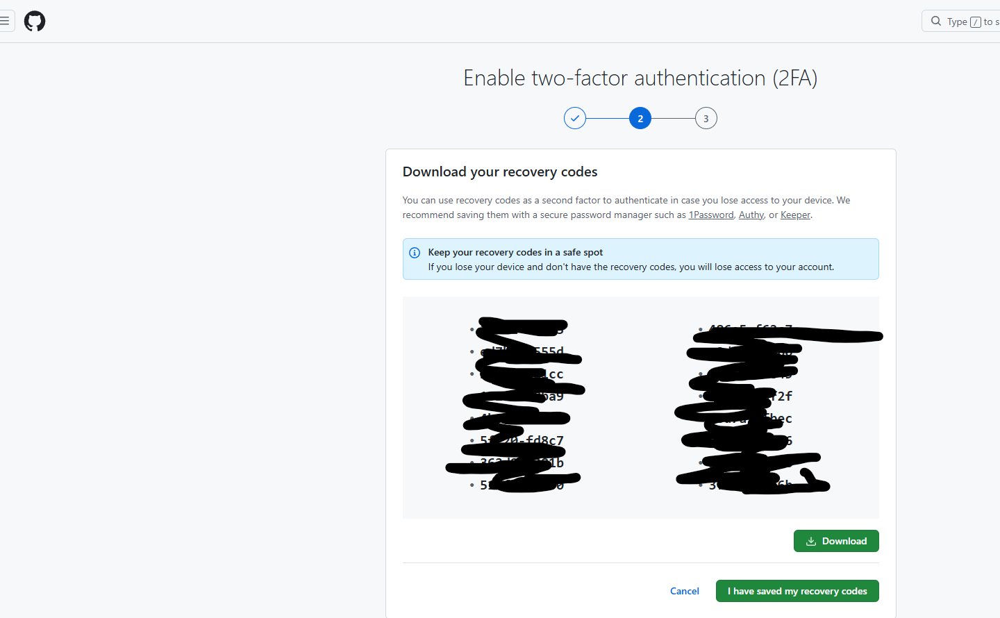
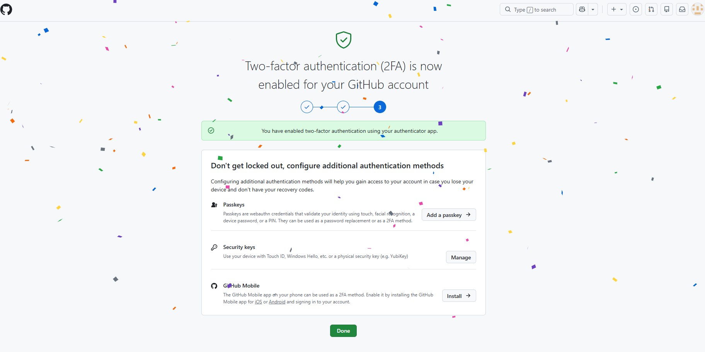

# M2 — Membuat Akun dan Mengamankannya

**Tingkat:** T0 — Pengamat &nbsp;·&nbsp; **Durasi:** 20 menit &nbsp;·&nbsp; **Prasyarat:** M1

## Tujuan

Setelah modul ini, Anda dapat:

- Memiliki akun GitHub yang aktif dan terverifikasi.
- Mengaktifkan autentikasi dua faktor pada akun tersebut.
- Bergabung ke organisasi `idtc-id`.

## Kenapa dua faktor diwajibkan

IDTC mewajibkan **autentikasi dua faktor** (kode tambahan selain kata sandi) bagi setiap anggota organisasi. Ini bukan formalitas: IDTC memiliki anggota dengan berbagai latar belakang dan sangat mungkin memiliki informasi yang sensitif. Bila kata sandi seorang anggota bocor, autentikasi dua faktor adalah lapisan terakhir yang mencegah orang lain masuk ke akunnya dan mengubah dokumen komunitas atas namanya.

Ini adalah **kebijakan rekomendasi Github**,  Lakukan langkah ini sebelum meminta undangan bergabung ke organisasi, supaya prosesnya tidak perlu diulang.

## Langkah

### 1. Mendaftar akun

1. Buka `github.com/signup` di browser.
2. Isi surel, kata sandi, dan nama pengguna (username) yang diminta. Pilih nama pengguna yang mudah dikenali rekan Pokja Anda — sebaiknya memuat nama asli Anda.

   

3. Klik **Create account**. GitHub akan meminta Anda memasukkan kode konfirmasi yang dikirim ke surel Anda.

   

4. Buka kotak masuk surel Anda, cari surel dari GitHub berjudul "Your GitHub launch code", lalu salin kode delapan digit di dalamnya.

   

5. Masukkan kode tersebut pada layar konfirmasi. GitHub akan menampilkan pesan akun berhasil dibuat dan meminta Anda masuk (sign in) memakai surel/username dan kata sandi yang tadi didaftarkan.

   

6. Setelah masuk, Anda akan melihat halaman utama (Dashboard) GitHub — tandanya akun Anda sudah aktif dan siap dipakai.

   

Bila surel kode tidak kunjung muncul dalam beberapa menit, periksa folder **Spam** atau **Promosi** pada kotak masuk Anda sebelum mencoba mendaftar ulang — mendaftar dua kali dengan surel yang sama akan ditolak oleh sistem.

### 2. Mengaktifkan autentikasi dua faktor

1. Setelah masuk, klik foto profil Anda di kanan atas, lalu pilih **Settings**.
2. Di menu kiri, klik **Password and authentication**.
3. Pada bagian **Two-factor authentication**, klik **Enable two-factor authentication**.

   

4. Pilih metode **aplikasi autentikator** (disarankan) — misalnya Google Authenticator atau Microsoft Authenticator, dipasang lebih dulu di ponsel Anda dari toko aplikasi.
5. Pindai (scan) kode QR yang tampil di layar memakai aplikasi autentikator tersebut, lalu masukkan enam digit kode yang muncul di aplikasi ke kotak konfirmasi GitHub, lalu klik **Continue**.

   

6. GitHub akan menampilkan **kode cadangan (recovery codes)** — sederet kode sekali pakai. Klik **Download** untuk menyimpannya, lalu klik **I have saved my recovery codes**.

   

7. **Simpan kode cadangan ini di tempat aman di luar ponsel Anda** — misalnya dicetak atau disimpan di pengelola kata sandi. Kode ini satu-satunya jalan masuk bila ponsel Anda hilang atau berganti.
8. GitHub menampilkan konfirmasi bahwa autentikasi dua faktor sudah aktif pada akun Anda.

   

### 3. Bergabung ke organisasi idtc-id

1. Kirim nama pengguna GitHub Anda kepada pengurus Pokja melalui kanal yang sudah disepakati (WhatsApp atau surel Sekretariat). Periksa ulang ejaannya sebelum mengirim.
2. Tunggu surel undangan dari GitHub dengan judul mengenai organisasi `idtc-id`.

   > 🔲 **Tangkapan layar belum tersedia** — *Surel undangan organisasi*. Perlu diambil dari kotak masuk surel anggota yang benar-benar diundang; samarkan alamat surel penerima sebelum digunakan di manual ini.

3. Buka surel tersebut dan klik **View invitation**, lalu klik **Join idtc-id**.
4. Setelah diterima, buka `github.com/idtc-id` — nama Anda kini terdaftar sebagai anggota organisasi.

## Latihan

Aktifkan autentikasi dua faktor di akun Anda, simpan kode cadangannya di tempat yang bukan ponsel yang sama, lalu kirim nama pengguna Anda kepada pengurus Pokja untuk diundang.

## Kesalahan umum yang harus diantisipasi

- **Kode cadangan tidak disimpan, lalu ponsel hilang atau diganti.** Tanpa kode cadangan, akun tidak bisa dipulihkan sendiri dan harus melalui proses pemulihan GitHub yang memakan waktu. Ingatkan peserta menyimpannya *sebelum* menutup layar.
- **Nama pengguna dikirim dengan salah ketik**, sehingga pengurus mengundang akun yang salah dan undangan tidak pernah sampai. Minta peserta menyalin-tempel nama pengguna, bukan mengetik ulang dari ingatan.
- **Peserta menutup layar kode QR sebelum sempat memindainya**, lalu harus mengulang proses pengaktifan dari awal. Ingatkan agar aplikasi autentikator sudah terpasang di ponsel *sebelum* memulai langkah ini.

## Ringkasan

Akun GitHub yang aman adalah syarat masuk untuk semua modul berikutnya. Dua faktor wajib karena melindungi dokumen sensitif komunitas, dan kode cadangan adalah jaring pengaman satu-satunya bila ponsel bermasalah. Setelah akun aktif dan bergabung ke `idtc-id`, Anda siap menjelajah repositori secara lebih mendalam pada M3.
