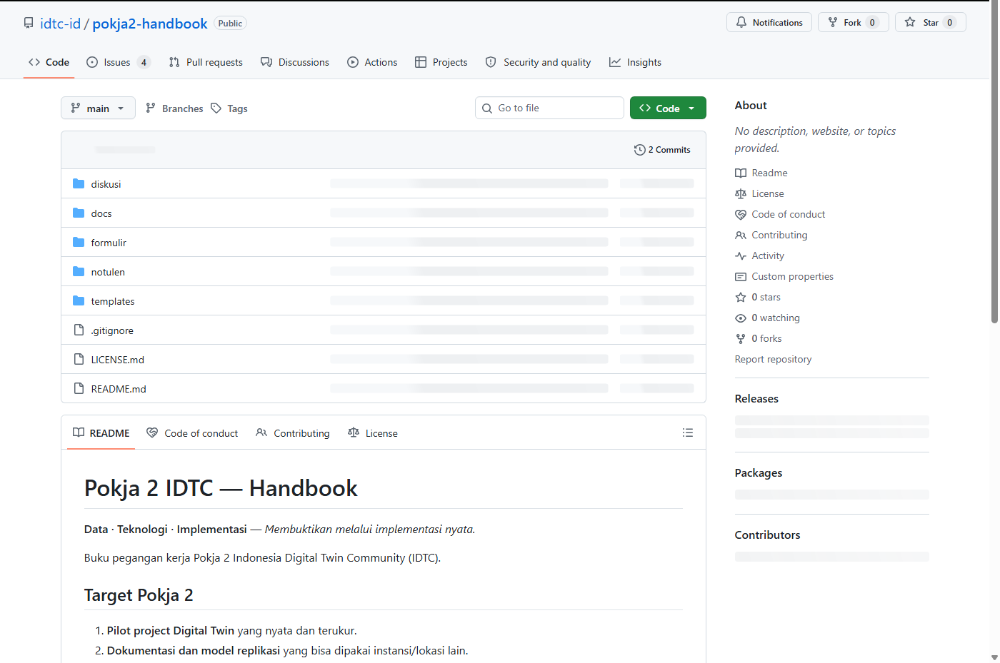
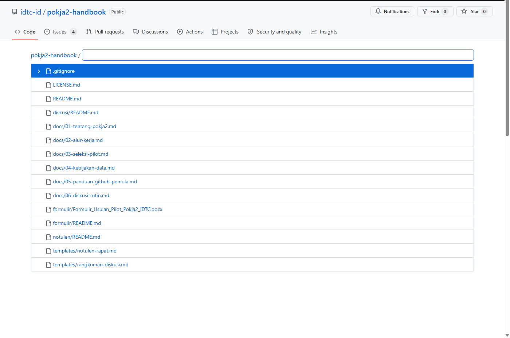
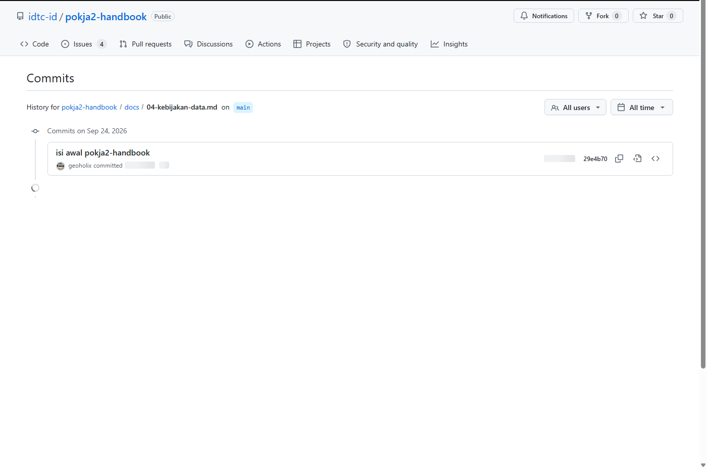

# M3 — Menjelajah Repositori IDTC

**Tingkat:** T0 — Pengamat &nbsp;·&nbsp; **Durasi:** 20 menit &nbsp;·&nbsp; **Prasyarat:** M2

## Tujuan

Setelah modul ini, Anda dapat:

- Menjelaskan fungsi tab **Code**, **Issues**, **Discussions**, dan **Projects** pada sebuah repo.
- Menemukan dokumen tertentu di dalam repo memakai pencarian.
- Membaca riwayat perubahan sebuah berkas untuk mengetahui siapa mengubah apa.

## Anatomi sebuah repo

Setiap repo di `idtc-id` punya struktur yang sama:

- **README.md** — halaman pembuka yang tampil otomatis saat repo dibuka, berisi ringkasan isi dan cara memakainya.
- **Folder** — mengelompokkan berkas menurut topik, misalnya `docs/` untuk dokumen kebijakan.
- **Berkas** — kebanyakan berformat `.md` (Markdown), yaitu teks yang diformat otomatis oleh GitHub menjadi judul, daftar, dan tabel.

Di bagian atas setiap repo ada beberapa tab. Empat yang paling sering dipakai anggota IDTC:

| Tab | Fungsi |
|---|---|
| **Code** | Melihat isi repo: folder, berkas, dan README |
| **Issues** | Tugas konkret dan usulan yang perlu ditindaklanjuti |
| **Discussions** | Percakapan terbuka: pertanyaan, ide, pengumuman |
| **Projects** | Papan pemantauan yang merangkum status pekerjaan lintas repo |

Issues dan Discussions dibahas lebih dalam di M4 dan M5; Projects di M8. Modul ini fokus pada tab **Code** dan cara mencari isinya.

Tidak semua tab tersedia di setiap repo — repo yang tidak memakai Discussions, misalnya, tidak menampilkan tab tersebut sama sekali. Ini normal dan bukan berarti ada yang salah dengan repo tersebut.

## Langkah

### 1. Mengenali tampilan repo

1. Buka repo `pokja2-handbook` di `github.com/idtc-id/pokja2-handbook`.
2. Perhatikan baris tab di bawah nama repo: **Code**, **Issues**, **Pull requests**, **Discussions**, **Actions**, **Projects**. Tidak semua tab dipakai aktif oleh setiap repo.

   

3. Di tab **Code**, perhatikan daftar folder (ikon folder) dan berkas (ikon lembar) di bawah nama repo.

### 2. Mencari dokumen tertentu

1. Tekan tombol `/` pada papan ketik, atau klik kotak **Go to file** di bagian atas daftar berkas.
2. Ketik kata kunci, misalnya `kebijakan data`.

   

3. GitHub akan menampilkan daftar berkas yang cocok. Klik salah satu hasil untuk langsung membukanya.

Ini jauh lebih cepat daripada membuka folder satu demi satu, terutama pada repo yang sudah berisi banyak dokumen.

### 3. Membaca riwayat perubahan sebuah berkas

1. Buka berkas `docs/04-kebijakan-data.md` di `pokja2-handbook` (pakai cara pencarian di atas bila perlu).
2. Di kanan atas tampilan berkas, klik ikon jam kecil bertuliskan **History**.

   

3. Anda akan melihat daftar setiap perubahan pada berkas ini, diurutkan dari yang terbaru: siapa yang mengubah (foto dan nama), pesan singkat tentang perubahan itu, dan kapan dilakukan.
4. Klik salah satu baris untuk melihat persis bagian mana yang berubah — teks yang dihapus tampil dengan latar merah, teks yang ditambah dengan latar hijau.

Kebiasaan ini berguna sebelum menghubungi seseorang untuk bertanya soal sebuah dokumen: sering kali jawabannya sudah terlihat dari riwayat perubahan itu sendiri, tanpa perlu menunggu balasan.

## Latihan

Temukan dokumen kebijakan data di `pokja2-handbook` memakai kotak pencarian (bukan menjelajah folder satu per satu), lalu buka riwayatnya dan sebutkan siapa yang terakhir mengubahnya.

## Kesalahan umum yang harus diantisipasi

- **Peserta tersesat menjelajah folder satu demi satu** pada repo yang isinya sudah banyak. Ajarkan kotak pencarian atau tombol `/` di awal, bukan di akhir, supaya kebiasaan yang terbentuk benar sejak awal.
- **Peserta mengira "History" menampilkan versi lama yang sudah tidak berlaku.** Jelaskan bahwa History adalah catatan, bukan kumpulan versi aktif — dokumen yang berlaku selalu yang tampil saat berkas pertama kali dibuka.

## Ringkasan

Tab Code adalah tempat membaca dokumen; pencarian di dalam repo membuat pencarian dokumen tertentu jauh lebih cepat daripada menjelajah folder manual; dan tab History pada setiap berkas menjawab pertanyaan "siapa mengubah ini dan kapan" — persis kemampuan yang tidak dimiliki WhatsApp atau surel. Modul berikutnya (M4) mulai masuk ke interaksi: bertanya dan berdiskusi lewat Discussions.
