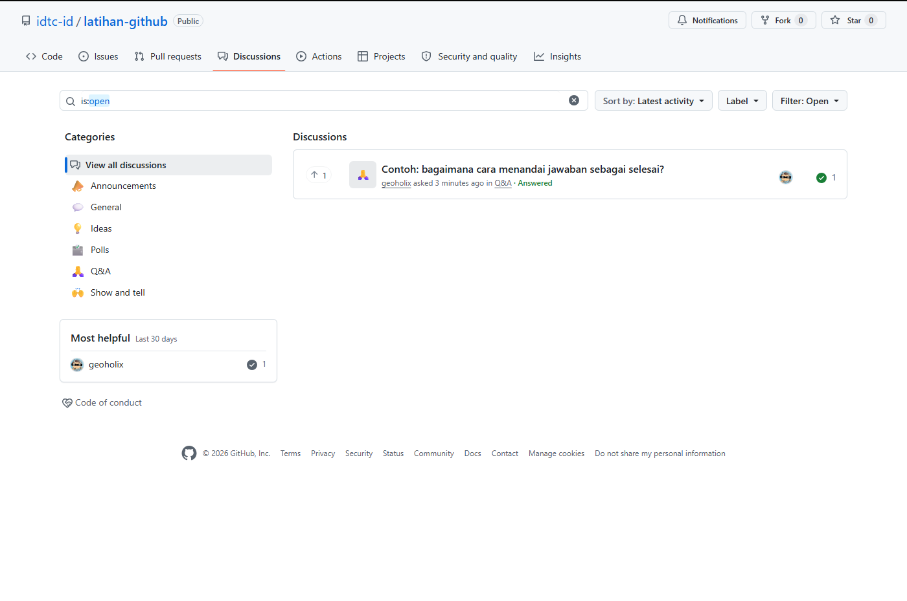
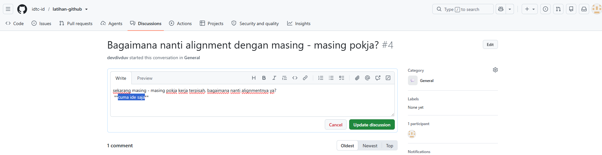
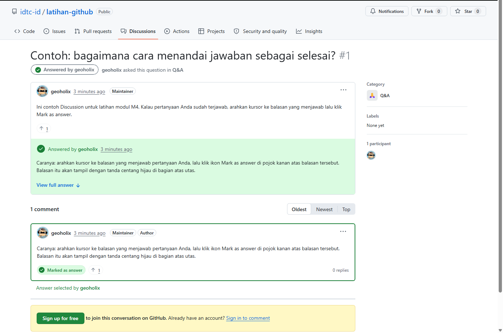

# M4 — Bertanya dan Berdiskusi

**Tingkat:** T1 — Peserta &nbsp;·&nbsp; **Durasi:** 20 menit &nbsp;·&nbsp; **Prasyarat:** M3

## Tujuan

Setelah modul ini, Anda dapat:

- Membuka Discussion baru pada kategori yang tepat.
- Membalas sebuah utas dan menandai jawaban yang menyelesaikan pertanyaan.

## Discussions vs Issues

Dua fitur ini sering tertukar oleh pemula:

- **Discussions** — percakapan terbuka: pertanyaan, ide, perkenalan diri, pengumuman. Tidak selalu berujung pada tindakan.
- **Issues** — pekerjaan konkret yang perlu dilakukan seseorang dan bisa ditutup ketika selesai (dibahas di M5).

Aturan sederhananya: **bila jawabannya berupa penjelasan, itu Discussion; bila jawabannya berupa tugas yang dikerjakan, itu Issue.**

Contoh: "Apa beda Jalur A dan Jalur B di kurikulum Pokja 3?" adalah Discussion — jawabannya cukup penjelasan. "Tautan modul Jalur A rusak, tolong diperbaiki" adalah Issue — ada pekerjaan konkret yang perlu diselesaikan seseorang.

## Kategori yang tersedia

Setiap handbook Pokja punya beberapa kategori Discussion, misalnya **Pengumuman**, **Tanya jawab**, **Perkenalan**, dan **Ide**. Pilih kategori yang paling sesuai sebelum menulis — ini membantu pengurus menyaring mana yang perlu tanggapan cepat.

Bila ragu memilih kategori, pilih yang paling mendekati lalu tulis saja — pengurus dapat memindahkan Discussion ke kategori lain kapan pun tanpa kehilangan isi percakapannya.

## Langkah

### 1. Membuka Discussion baru

1. Buka handbook Pokja Anda, klik tab **Discussions**.
2. Klik tombol **New discussion** di kanan atas.

   

3. Pilih kategori yang sesuai dari daftar yang muncul.
4. Isi **Title** dengan kalimat singkat yang menjelaskan isi, misalnya "Perkenalan — Budi, Dinas PUPR Kota X", bukan sekadar "Halo".
5. Isi kotak isi (body) dengan penjelasan lebih lengkap. Klik tab **Preview** untuk melihat bagaimana format Markdown Anda akan tampil sebelum dikirim.

   

6. Klik **Start discussion**.

### 2. Membalas dan menandai jawaban

1. Buka sebuah utas Discussion yang sudah berjalan.
2. Ketik balasan Anda di kotak paling bawah, lalu klik **Comment**.
3. Bila Anda adalah pembuat utas dan salah satu balasan menjawab pertanyaan Anda dengan tuntas, arahkan kursor ke balasan itu dan klik ikon **Mark as answer**.

   

4. Balasan tersebut akan tampil dengan tanda centang hijau di bagian atas utas, membantu anggota lain yang membuka utas yang sama di kemudian hari langsung menemukan jawabannya tanpa membaca semua balasan.

## Etika berdiskusi

- Gunakan bahasa yang sopan dan langsung ke inti — anggota lain membaca utas ini bertahun-tahun ke depan.
- Tandai (mention) orang seperlunya saja dengan `@nama-pengguna`; menandai terlalu banyak orang membuat notifikasi berisik dan diabaikan.
- **Jangan menempelkan data sensitif** (data pribadi, dokumen internal instansi, kredensial) di dalam Discussion — utas ini bersifat publik dan tidak bisa disunting ulang secara aman setelah dibaca orang lain.

Anda bisa mengatur seberapa sering menerima notifikasi dari sebuah repo lewat tombol **Watch** di kanan atas halaman repo — pilih **Participating and @mentions** bila hanya ingin diberi tahu saat disebut atau saat utas yang Anda ikuti berbalas, tanpa dibanjiri notifikasi dari seluruh repo.

## Latihan

Buka kategori perkenalan di handbook Pokja Anda sendiri, lalu tulis satu Discussion baru untuk memperkenalkan diri.

## Kesalahan umum yang harus diantisipasi

- **Pertanyaan dibuat sebagai Issue padahal seharusnya Discussion.** Bila ini terjadi, pengurus bisa mengonversinya lewat menu **⋯ → Convert to discussion** — sebutkan solusi ini di sesi supaya peserta tidak takut salah pilih.
- **Judul dibiarkan kosong atau terlalu umum** seperti "Pertanyaan". Ingatkan bahwa judul yang jelas membantu anggota lain menemukan utas yang relevan lewat pencarian.

## Ringkasan

Discussions adalah tempat bertanya dan bertukar ide tanpa perlu berujung tindakan konkret; pilih kategori yang tepat dan tulis judul yang jelas agar mudah ditemukan kembali; tandai jawaban yang menuntaskan pertanyaan agar bermanfaat bagi pembaca berikutnya. Modul M5 melanjutkan ke pencatatan tugas yang lebih konkret lewat Issues.
