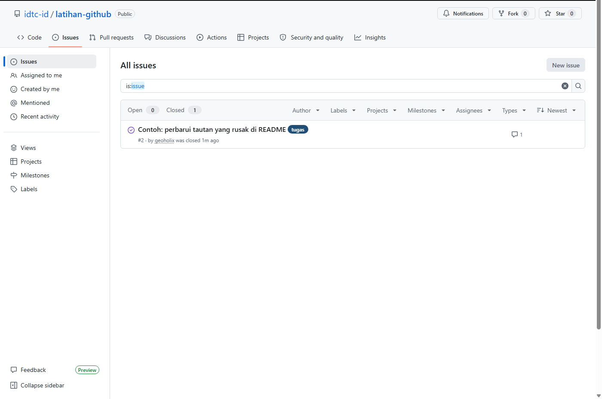
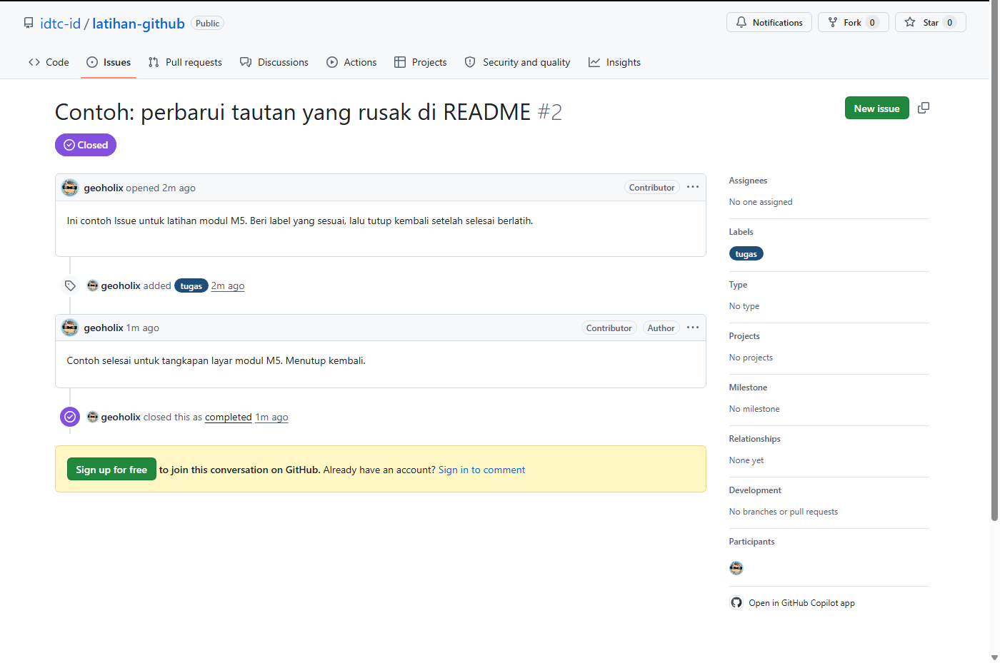

# M5 — Mencatat Tugas dan Usulan

**Tingkat:** T1 — Peserta &nbsp;·&nbsp; **Durasi:** 25 menit &nbsp;·&nbsp; **Prasyarat:** M4

## Tujuan

Setelah modul ini, Anda dapat:

- Membuat Issue baru memakai template yang tersedia.
- Memasang label yang tepat pada sebuah Issue.
- Menutup Issue yang sudah selesai dikerjakan.

## Apa itu Issue dan kapan dipakai

Issue adalah catatan satu pekerjaan konkret: sebuah tugas, usulan, atau laporan masalah yang bisa dianggap **selesai** pada suatu titik. Berbeda dengan Discussion (M4) yang terbuka dan bisa berlanjut tanpa akhir, sebuah Issue idealnya punya penyelesaian yang jelas — begitu pekerjaannya tuntas, Issue ditutup.

Contoh yang cocok dijadikan Issue: "Perbarui data anggota per Q3", "Tulis draf glosarium istilah Digital Twin", "Tautan ke dokumen kebijakan rusak di README".

Sebelum membuat Issue baru, gunakan kotak pencarian pada tab Issues untuk memeriksa apakah usulan serupa sudah pernah dicatat orang lain. Issue yang dobel membuat pekerjaan yang sama dikerjakan dua kali atau perhatian pengurus terpecah tanpa perlu.

## Template Issue

Sebagian besar repo di `idtc-id` sudah menyediakan **template Issue** — formulir siap pakai untuk jenis permintaan yang umum (misalnya usulan pilot, laporan masalah dokumen). Memakai template membuat Issue Anda otomatis memuat pertanyaan yang relevan, sehingga pengurus tidak perlu bolak-balik bertanya informasi dasar.

Bila jenis permintaan Anda tidak cocok dengan template mana pun, itu tidak masalah — pilih formulir kosong dan jelaskan sendiri secukupnya, asal judul dan isinya tetap jelas.

## Langkah

### 1. Membuat Issue baru

1. Buka repo yang dituju, klik tab **Issues**.
2. Klik tombol hijau **New issue**.

   

3. Pilih salah satu template yang muncul, sesuai jenis permintaan Anda. Bila tidak ada template yang cocok, pilih **Open a blank issue**.

   > 🔲 **Tangkapan layar belum tersedia** — *Pilihan template Issue*. Halaman pemilihan template hanya muncul untuk pengguna yang sudah masuk (login); ambil dari akun mana pun yang sudah menjadi anggota organisasi.

4. Isi **Title** dengan kalimat yang menyebutkan objek dan tindakan secara spesifik, misalnya "Perbarui tautan dokumen kebijakan data yang rusak di README", bukan sekadar "Masalah".
5. Lengkapi kotak isi (body) sesuai pertanyaan pada template.
6. Klik **Submit new issue**.

### 2. Memasang label

1. Di halaman Issue yang baru dibuat, lihat panel kanan bertuliskan **Labels**.
2. Klik ikon roda gigi di sebelahnya, lalu centang label yang sesuai — misalnya `tugas` untuk pekerjaan konkret, `dokumentasi` untuk perbaikan dokumen, atau `butuh-bantuan` bila mencari kontributor.

   

3. Klik di luar panel untuk menyimpan pilihan label.

### 3. Menugaskan orang dan menutup Issue

1. Pada panel kanan yang sama, klik ikon roda gigi di sebelah **Assignees** untuk menugaskan seseorang mengerjakannya — termasuk diri sendiri.
2. Setelah pekerjaan pada Issue tersebut selesai, gulir ke bawah kotak komentar dan klik tombol **Close issue**.

   

3. Issue yang tertutup tetap tersimpan dan bisa dibuka kembali (**Reopen issue**) bila ternyata belum benar-benar selesai.

Issue yang tertutup bukan berarti hilang — Anda tetap bisa menemukannya lewat pencarian dengan filter `is:closed`, misalnya untuk melihat riwayat pekerjaan yang sudah tuntas pada suatu topik.

## Latihan

Buat satu Issue usulan di repo `latihan-github`, beri label yang sesuai, lalu tutup kembali seolah-olah sudah selesai dikerjakan.

## Kesalahan umum yang harus diantisipasi

- **Judul Issue terlalu umum**, seperti "masalah" atau "tolong dicek". Ajarkan pola judul yang menyebut objek dan tindakan: "[objek] perlu [tindakan]".
- **Label tidak dipasang sama sekali**, sehingga Issue sulit disaring belakangan. Jadikan pemasangan label bagian tetap dari langkah pembuatan Issue, bukan langkah opsional.
- **Issue ditutup padahal pekerjaannya belum selesai**, hanya karena ingin membersihkan daftar. Tekankan bahwa menutup Issue berarti menyatakan "selesai", bukan "sudah dibaca".

## Ringkasan

Issue adalah satuan pekerjaan konkret yang bisa ditandai selesai, berbeda dari Discussion yang terbuka. Memakai template, menulis judul yang spesifik, memasang label, dan menutup Issue setelah tuntas membuat daftar pekerjaan komunitas mudah dipantau siapa pun. Kemampuan menutup Issue ini akan dipakai kembali di M8 saat memantau papan capaian, karena setiap kartu di papan tersebut sebenarnya adalah sebuah Issue.
