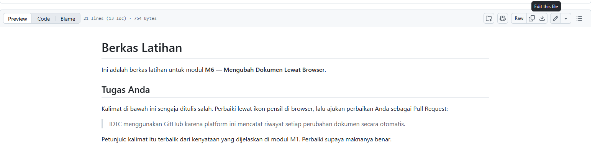
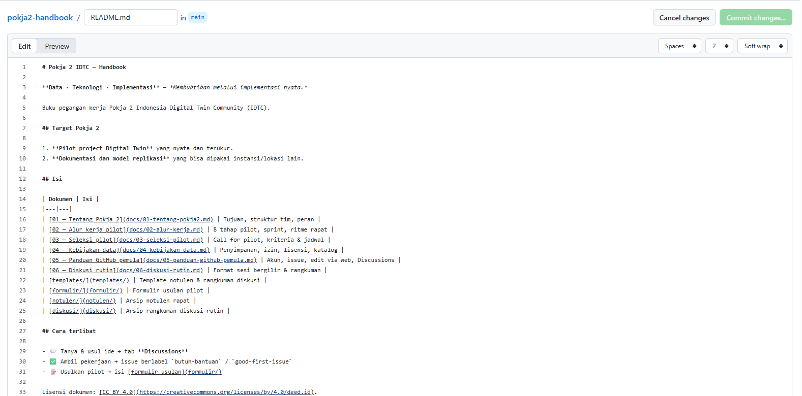
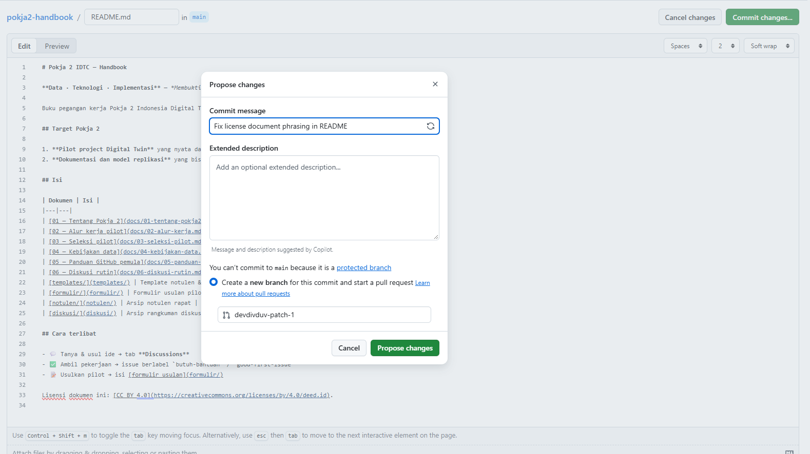
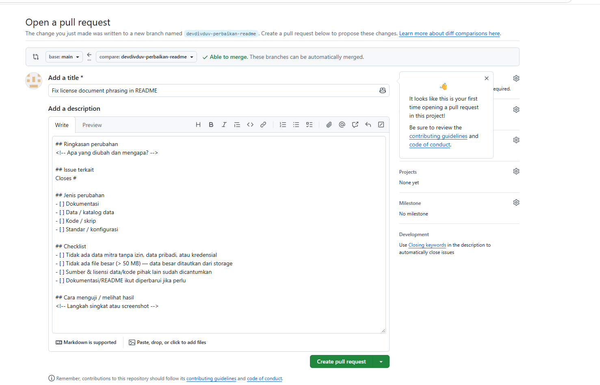
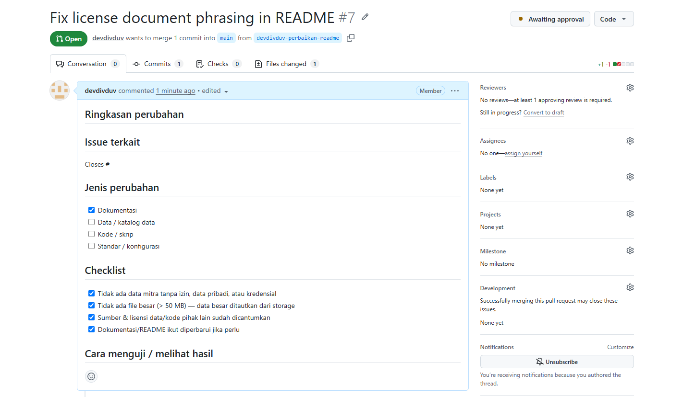

# M6 — Mengubah Dokumen Lewat Peramban

**Tingkat:** T2 — Kontributor &nbsp;·&nbsp; **Durasi:** 30 menit &nbsp;·&nbsp; **Prasyarat:** M5

> Modul ini adalah titik paling penting dalam seluruh rangkaian pelatihan. Sebagian besar anggota berhenti mencoba tepat di sini karena istilah "branch" dan "Pull Request" terasa asing. Ajarkan pelan-pelan dan pastikan setiap peserta menuntaskan latihannya sendiri sebelum melanjutkan ke M7.

## Tujuan

Setelah modul ini, Anda dapat:

- Mengubah satu berkas Markdown lewat peramban.
- Mengajukan perubahan tersebut sebagai Pull Request.
- Menjelaskan mengapa perubahan Anda tidak langsung masuk ke dokumen yang dilihat semua orang.

## Kenapa versi utama dilindungi

Setiap repo di `idtc-id` punya satu versi yang dianggap resmi, disebut **branch `main`**. Branch `main` **dilindungi**: tidak seorang pun, termasuk pengurus, bisa langsung menulis perubahan ke sana. Setiap perubahan — sekecil apa pun — harus lewat proses **Pull Request (PR)**: usulan perubahan yang ditelaah dulu oleh orang lain sebelum digabungkan.

Aturan ini terasa merepotkan pada mulanya, tetapi tujuannya melindungi komunitas dari dua hal: kesalahan ketik yang lolos tanpa ada yang memeriksa, dan perubahan sepihak pada dokumen yang sudah disepakati bersama. Pikirkan `main` sebagai lemari arsip resmi — Anda boleh mengusulkan revisi, tetapi revisi itu perlu disetujui sebelum masuk ke lemari.

Ketika Anda mengedit lewat peramban, GitHub secara otomatis membuatkan Anda **salinan kerja** (disebut branch) terpisah dari `main`. Perubahan Anda ditulis di salinan itu dulu — `main` sama sekali belum tersentuh sampai Pull Request Anda disetujui dan digabungkan.

## Langkah

### 1. Membuka mode ubah

1. Buka berkas Markdown (`.md`) yang ingin Anda ubah.
2. Klik ikon pensil (✏️) di kanan atas tampilan berkas, bertuliskan **Edit this file**.

   

3. Tampilan berkas berubah menjadi kotak teks yang bisa Anda ketik langsung, mirip catatan di aplikasi pengolah kata sederhana.

### 2. Mengubah teks dan memeriksa hasilnya

1. Ubah kalimat yang dituju. Ingat aturan Markdown dasar: `**tebal**`, `*miring*`, `- ` untuk daftar bertitik.
2. Sebelum menyimpan, klik tab **Preview** di atas kotak teks untuk melihat bagaimana hasilnya akan tampil setelah diformat.

   

3. Bila formatnya berantakan (misalnya tanda bintang muncul apa adanya), kembali ke tab **Edit** dan periksa kembali sintaks Markdown Anda.

### 3. Menyimpan sebagai salinan kerja

1. Gulir ke bawah sampai kotak **Commit changes**.
2. Isi kotak judul singkat yang menjelaskan perubahan, misalnya "Perbaiki tautan dokumen kebijakan data".
3. Di bawahnya ada dua pilihan: **Commit directly to the `main` branch** dan **Create a new branch for this commit and start a pull request**. Karena `main` dilindungi, pilihan pertama biasanya tidak akan berhasil disimpan — **selalu pilih pilihan kedua.**

   

4. GitHub akan mengisikan nama branch secara otomatis. Anda boleh membiarkannya.
5. Klik **Propose changes**.

### 4. Mengajukan Pull Request

1. Anda akan diarahkan ke formulir Pull Request. Isi **judul** yang jelas (biasanya sudah terisi otomatis dari judul commit Anda) dan **keterangan** singkat tentang *mengapa* perubahan ini perlu, bukan hanya *apa* yang berubah.

   

2. Bila perubahan ini menuntaskan sebuah Issue yang sudah ada, tulis `Closes #<nomor issue>` di kotak keterangan — Issue tersebut akan otomatis tertutup begitu PR digabungkan.
3. Klik **Create pull request**.
4. Anda akan melihat halaman PR yang menunjukkan status **menunggu telaah**. Ini normal — PR Anda kini menunggu penelaah (dibahas di M7).

   

### 5. Menanggapi komentar penelaah

1. Bila penelaah menulis komentar yang meminta perbaikan, buka kembali PR tersebut, klik ikon pensil pada berkas yang sama, dan ubang sekali lagi — perubahan baru akan otomatis masuk ke PR yang sama, tanpa perlu membuat PR baru.
2. Setelah memperbaiki, balas komentar penelaah singkat, misalnya "Sudah diperbaiki" agar penelaah tahu perubahan sudah dilakukan.

## Latihan

Di repo `latihan-github`, perbaiki satu kalimat pada berkas latihan yang tersedia dan ajukan sebagai Pull Request lengkap dengan judul dan keterangan yang jelas.

## Kesalahan umum yang harus diantisipasi

- **Peserta memilih "Commit directly to the `main` branch"** lalu bingung karena perubahan ditolak atau tidak tersimpan seperti yang diharapkan. Ingatkan sebelum langkah ini bahwa pilihan kedua ("Create a new branch...") adalah satu-satunya jalan yang akan berhasil di repo IDTC.
- **Judul PR dibiarkan kosong atau berisi teks bawaan** seperti "Update namafile.md". Minta peserta menuliskan ulang dengan kalimat yang menjelaskan perubahan.
- **Lupa menekan Preview**, sehingga tanda Markdown seperti `**` atau `#` muncul apa adanya di dokumen setelah digabungkan. Jadikan mengecek Preview sebagai kebiasaan tetap sebelum menyimpan.

## Ringkasan

Mengubah dokumen di GitHub selalu melalui tiga tahap: edit lewat ikon pensil, simpan sebagai salinan kerja (branch) lewat "Create a new branch and start a pull request", lalu ajukan sebagai Pull Request yang menunggu telaah. Alur ini memang lebih panjang daripada mengetik langsung, tetapi itulah yang membuat `main` tetap terjaga. Modul M7 melanjutkan dari sudut pandang penelaah: bagaimana memeriksa dan menggabungkan Pull Request seperti ini.
