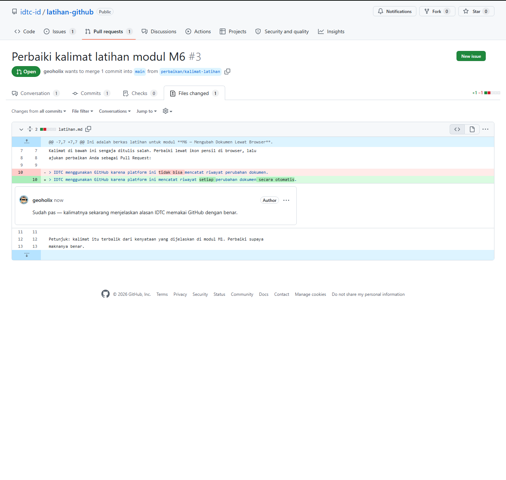

# M7 — Menelaah dan Menggabungkan

**Tingkat:** T3 — Pengelola &nbsp;·&nbsp; **Durasi:** 25 menit &nbsp;·&nbsp; **Prasyarat:** M6

## Tujuan

Setelah modul ini, Anda dapat:

- Memberi komentar pada baris tertentu dalam sebuah Pull Request.
- Memilih antara menyetujui (Approve) atau meminta perbaikan (Request changes).
- Menggabungkan Pull Request sesuai aturan yang berlaku di IDTC.

## Syarat menggabungkan di IDTC

Setiap repo di `idtc-id` mensyaratkan minimal **satu persetujuan (approval)** sebelum sebuah Pull Request bisa digabungkan — kecuali repo `standar-dan-panduan`, yang mensyaratkan **dua persetujuan** karena isinya adalah dokumen standar rujukan bersama. Selain itu, seluruh percakapan (komentar) pada PR harus berstatus selesai sebelum tombol gabung aktif — GitHub menyebutnya *conversation resolution*.

Modul ini ditujukan untuk pengurus, koordinator Pokja, dan lead pilot yang diberi peran menelaah.

## Langkah

### 1. Membaca perubahan

1. Buka Pull Request yang akan ditelaah, klik tab **Files changed**.

   

2. GitHub menampilkan perubahan dengan latar merah untuk baris yang dihapus dan latar hijau untuk baris yang ditambahkan. Baca keduanya untuk memahami apa yang sebenarnya berubah, bukan hanya sekilas.

### 2. Memberi komentar per baris

1. Arahkan kursor ke nomor baris yang ingin dikomentari. Ikon `+` biru akan muncul di sebelah kiri baris tersebut.
2. Klik ikon `+` itu, ketik komentar Anda di kotak yang muncul.

   

3. Klik **Start a review** (bila ini komentar pertama Anda pada PR ini) atau **Add review comment** (bila sudah ada review yang sedang berjalan). Komentar yang ditulis lewat **Start a review** belum terkirim ke pengaju sampai Anda menyelesaikan review-nya pada langkah berikutnya — ini memberi Anda kesempatan menambah beberapa komentar sekaligus sebelum semuanya terkirim bersamaan.

### 3. Menyetujui atau meminta perbaikan

1. Setelah selesai membaca dan mengomentari, klik tombol **Review changes** di kanan atas.

   > 🔲 **Tangkapan layar belum tersedia** — *Menu Review changes*. Tombol ini hanya tampil untuk penelaah yang sudah masuk (login); pengunjung anonim melihat ajakan "Sign up" sebagai gantinya. Ambil dari akun anggota organisasi.

2. Pilih salah satu:
   - **Approve** — perubahan sudah baik dan siap digabungkan.
   - **Request changes** — ada yang perlu diperbaiki dulu sebelum bisa digabungkan.
   - **Comment** — sekadar memberi masukan tanpa menyatakan sikap setuju atau tidak.
3. Tulis ringkasan singkat di kotak yang tersedia, lalu klik **Submit review**.
4. Bila Anda memilih **Request changes**, beri tahu pengaju lewat komentar apa yang perlu diperbaiki. Pengaju bisa memperbaikinya langsung di PR yang sama (lihat M6, langkah "Menanggapi komentar penelaah") tanpa membuka PR baru.

### 4. Menggabungkan Pull Request

1. Setelah syarat persetujuan terpenuhi dan seluruh percakapan ditandai selesai, tombol gabung di bagian bawah PR akan aktif.
2. Klik tombol **Squash and merge**.

   > 🔲 **Tangkapan layar belum tersedia** — *Tombol Squash and merge*. Tombol gabung hanya tampil untuk anggota dengan akses tulis yang sudah masuk (login); ambil dari akun yang berperan sebagai penelaah/pengelola repo.

3. IDTC memilih **Squash and merge** (bukan pilihan gabung lainnya) karena cara ini merangkum seluruh commit kecil dalam satu PR menjadi satu catatan perubahan yang rapi di riwayat `main` — riwayat proyek jadi lebih mudah dibaca ke depannya, alih-alih dipenuhi puluhan commit kecil seperti "perbaikan typo" atau "coba lagi".
4. Konfirmasi judul penggabungan bila diminta, lalu klik **Confirm squash and merge**.
5. Branch salinan kerja yang dipakai PR ini akan terhapus otomatis setelah digabungkan — Anda tidak perlu menghapusnya secara manual.

## Latihan

Telaah Pull Request rekan Anda di repo `latihan-github`: beri satu komentar pada baris tertentu, lalu setujui dan gabungkan.

## Kesalahan umum yang harus diantisipasi

- **Menyetujui tanpa benar-benar membaca perubahan** hanya karena ingin cepat selesai. Ingatkan bahwa persetujuan adalah pernyataan tanggung jawab, bukan formalitas — terutama pada repo `standar-dan-panduan` yang menjadi rujukan bersama.
- **Mencoba menggabungkan padahal masih ada percakapan yang belum ditandai selesai.** Tombol gabung memang akan tetap nonaktif sampai semua percakapan diselesaikan (diklik **Resolve conversation**) — ini bukan galat, melainkan aturan yang disengaja.

## Ringkasan

Menelaah PR berarti membaca tab Files changed, memberi komentar per baris bila perlu, lalu menyatakan sikap lewat Approve atau Request changes. Menggabungkan hanya bisa dilakukan setelah syarat persetujuan (satu untuk kebanyakan repo, dua untuk `standar-dan-panduan`) dan penyelesaian seluruh percakapan terpenuhi, dan IDTC selalu memakai Squash and merge agar riwayat `main` tetap rapi. Modul M8 melanjutkan ke cara memantau seluruh pekerjaan ini secara ringkas lewat papan Project.
