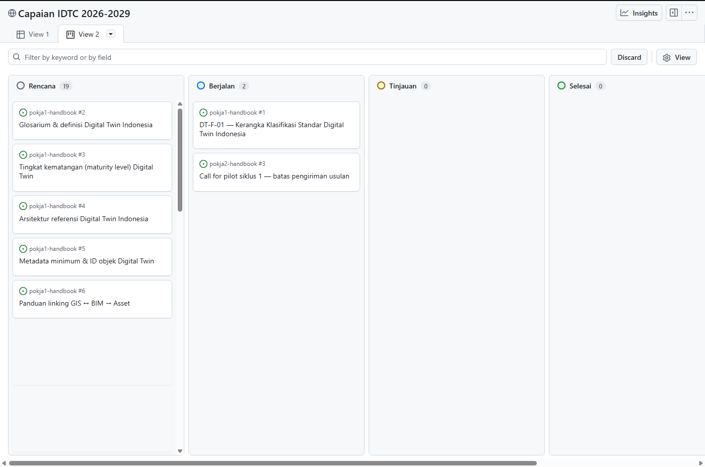
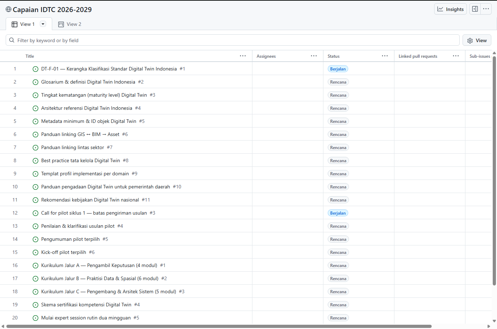
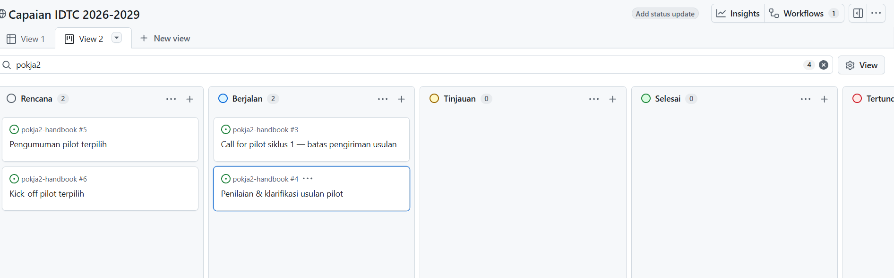
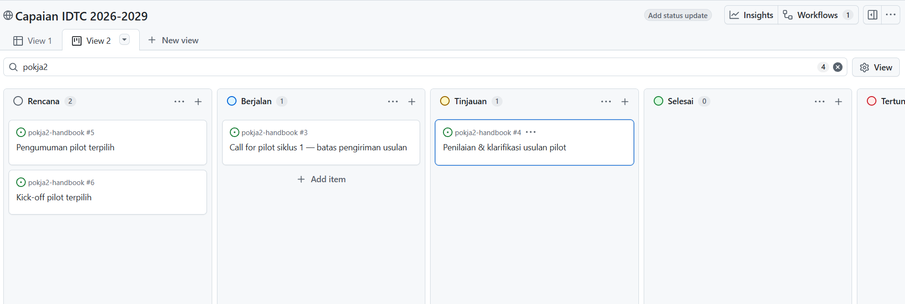

# M8 — Memantau Capaian Lewat Project

**Tingkat:** T3 — Pengelola &nbsp;·&nbsp; **Durasi:** 20 menit &nbsp;·&nbsp; **Prasyarat:** M7

## Tujuan

Setelah modul ini, Anda dapat:

- Membaca papan **Capaian IDTC 2026-2029**.
- Menyaring kartu menurut Pokja.
- Memperbarui status kartu miliknya sendiri.

## Apa itu papan Capaian IDTC

**Capaian IDTC 2026-2029** adalah satu papan (Project) yang merangkum seluruh target dan pekerjaan komunitas lintas repo dalam satu tampilan. Setiap kartu di papan ini sebenarnya adalah sebuah **Issue** (lihat M5) yang diambil dari salah satu repo Pokja — bedanya, di sini semua Issue dari berbagai repo terlihat bersama, lengkap dengan status dan target waktunya.

Setiap kartu memiliki lima kolom informasi (field):

| Field | Arti |
|---|---|
| **Status** | Rencana, Berjalan, Tinjauan, Selesai, atau Tertunda |
| **Pokja** | Pokja 1, Pokja 2, Pokja 3, Sekjen, atau Sekretariat mana yang bertanggung jawab |
| **Jenis** | Jenis keluaran — Standar, Guideline, Framework, Pilot, Modul, dan sejenisnya |
| **Target** | Tanggal target penyelesaian |
| **Tahap** | Catatan bebas tentang tahap pengerjaan saat ini |

## Langkah

### 1. Membuka dan membaca papan

1. Buka `github.com/orgs/idtc-id/projects`, lalu klik **Capaian IDTC 2026-2029**.
2. Tampilan yang muncul pertama kali biasanya berupa **Papan** (board): kartu tersusun dalam kolom menurut Status.

   

> **VERIFIKASI:** modul ini menyebut empat tampilan siap pakai — Papan, Per Pokja, Linimasa, dan Butuh perhatian. Pastikan keempatnya sudah dibuat di papan sebelum modul ini diajarkan; bila belum, sesuaikan langkah 2 dengan tampilan yang benar-benar tersedia saat itu.

2. Di bagian atas papan ada beberapa tab tampilan. Klik tab **Per Pokja** untuk melihat pekerjaan dikelompokkan sebagai tabel per Pokja, lebih mudah dibaca bagi yang terbiasa dengan tabel.

   

3. Tab **Linimasa** menampilkan kartu sebagai garis waktu berdasarkan field Target — berguna untuk melihat apa yang mendekati tenggat.
4. Tab **Butuh perhatian** menyaring otomatis kartu berstatus **Tertunda** atau yang lewat dari tanggal Target — ini yang paling relevan dilihat pengurus setiap minggu.

### 2. Menyaring menurut Pokja

1. Pada tampilan mana pun, klik kotak **Filter** di bagian atas papan.
2. Ketik `Pokja: "Pokja 2"` (ganti sesuai Pokja Anda), atau pilih dari daftar yang muncul otomatis.
3. Papan akan langsung menampilkan hanya kartu milik Pokja tersebut.

### 3. Memperbarui status kartu

1. Cara tercepat: **seret (drag) kartu** dari satu kolom ke kolom lain pada tampilan Papan. Misalnya, seret kartu dari kolom "Berjalan" ke kolom "Tinjauan" — field Status kartu itu otomatis berubah mengikuti kolom barunya.

   

   

2. Untuk mengubah field lain (Tahap, Target) atau melihat detail lengkap, klik kartunya untuk membuka panel detail, lalu ubah field yang diinginkan di sana.
3. Bila pekerjaan pada kartu tersebut benar-benar sudah tuntas, jangan hanya menyeretnya ke kolom "Selesai" — buka Issue aslinya (klik judul kartu) dan **tutup Issue tersebut** (lihat langkah menutup Issue di M5). Menutup Issue akan otomatis memindahkan kartunya ke Status "Selesai" di papan.

Sebaliknya, mengubah field seperti Tahap atau Target di papan tidak memengaruhi Issue aslinya sama sekali — keduanya memang boleh diperbarui secara terpisah kapan pun diperlukan.

## Latihan

Buka papan Capaian IDTC, saring menurut Pokja Anda sendiri, lalu perbarui field Tahap pada satu kartu yang menjadi tanggung jawab Anda.

## Kesalahan umum yang harus diantisipasi

- **Mengubah Status kartu di papan tanpa menutup Issue aslinya**, sehingga kartu terlihat "Selesai" padahal Issue-nya masih terbuka di repo — kondisi ini membingungkan siapa pun yang membuka repo tersebut langsung. Ajarkan bahwa kartu dan Issue adalah representasi dari hal yang sama, dan menutup Issue adalah cara yang benar untuk menandai pekerjaan tuntas.

## Ringkasan

Papan Capaian IDTC merangkum seluruh Issue lintas repo dalam satu tampilan yang bisa dibaca sebagai papan, tabel per Pokja, linimasa, atau daftar yang butuh perhatian. Menyaring menurut Pokja mempersempit tampilan menjadi relevan bagi Anda, dan menutup Issue asli — bukan sekadar mengubah field di papan — adalah cara yang benar menandai pekerjaan selesai. Modul terakhir, M9, membahas aturan main data dan keamanan yang berlaku di semua modul sebelumnya.
